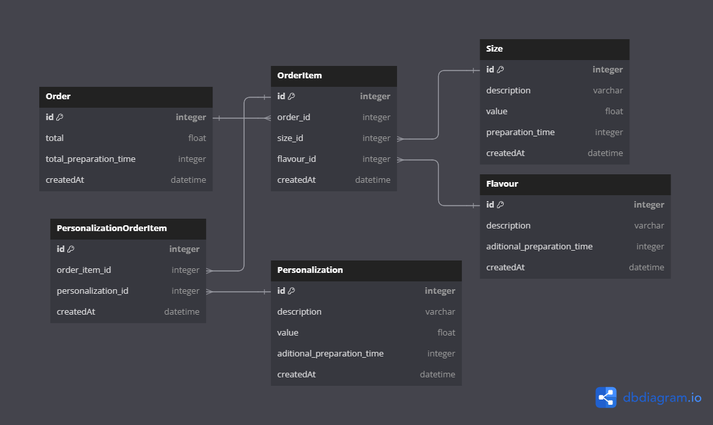

# VoorsPizza - API

## Description

API contruída com NestJS, Typescript e NodeJs para receber pedidos de uma pizzaria.

## Tecnologias Utilizadas

- `API`: NestJS
- `ORM`: Prisma
- `Validações de Requisições`: Class Validator e Class Transformer
- `Testes`: Jest
- `Documentação de API`: Swagger
- `Containers`: Docker

## Informações Importantes

Como padrão a porta da aplicação foi definida na imagem docker como `3001`

Então para acessá-la:

URL: `http://localhost:3000/` \
Documentação com Swagger: `http://localhost:3000/api#/`

A aplicação conta com 99% de cobertura de testes, cobrindo da camada `Data` até a `Main`

## Instalação de dependências

```bash
$ npm install
```

## Rodando em localhost

```bash
# development
$ npm run start

# watch mode
$ npm run start:dev

# production mode
$ npm run start:migrate:prod
```

## Testes

```bash
# unit tests
$ npm run test:unit

# test coverage
$ npm run test:cov
```

## Docker

A aplicação foi construída para ser executada com containers, então para construir a imagem da `API` e do `POSTGRES` utilize esse comando abaixo:

```bash
# build image
$ docker-compose up
```

## Decisões Técnicas

## Modelagem

De acordo com meus conhecimentos em modelagem, criei essa estrutura que consegue entregar flexibilidade permitindo o cadastro de novos sabores, tamanhos e personalizações. Também optei por salvar as informações de tempo total de preparo e valor do pedido em banco para evitar cálculos via código. Algumas tabelas poderiam ser abstraídas em uma mais genèrica, porém escolhi criar tabelas específicas para dividir melhor os dados, facilitando a busca e entendimento.

Adicionei o campo `createdAt` em todas as tabelas para permitir auditoria simples sobre informações de cadastro do registro.

Legenda:

- Order `(tb_order)`
  representa o pedido realizado pelo usuário
- OrderItem `(tb_order_item)`
  representa cada pizza montada pelo usuário
- PersonalizationOrderItem `(tb_personalization_order_item)`
  representa as personalizações selecionadas de cada pizza
- Personalization `(tb_personalization)`
  representa as personalizações cadastradas (Extra bacon...)
- Size `(tb_size)`
  representa os tamanhos de pizza disponíveis
- Flavour `(tb_flavour)`
  representa os sabores de pizza disponíveis

&nbsp;&nbsp;

## Transações

Para garantir a integridade de operações, utilizei do Prisma para gerenciar transactions em banco de dados. Então em toda criação de pedido, é garantido que as informações só serão cadastradas caso todas ocorram normalmente, caso haja um erro inesperado em uma das operações, todo o resto é cancelado. Assim garantindo que todos dados presentes no banco são consistentes e completos.

## Endpoints

Baseado no que foi informado na descrição do teste, optei por implementar alguns endpoints de `GET` para buscar informações que podem ser importantes pro frontend e decidi implementar um endpoint `POST` para criação de pedidos.

Escolhi ir por esse caminho, pois na minha visão é o mais coerente e otimizado para a situação, evitando desperdícios de dados e requisições desnecessárias.

- `GET - /flavours`
- `GET - /sizes`
- `GET - /personalizations`
- `GET - /order/:id`
- `POST - /order`

A documentação da API foi implementada com Swagger e se encontra no endpoint: `http://localhost:3000/api#/`

## Status Code

Todos os endpoints podem retornar esses seguintes status:

- `200 - Ok`
  Processamento realizado com sucesso
- `400 - Bad Request`
  Envio de valores/parametros inválidos
- `404 - Not Found`
  Envio de dados inexistentes na base
- `500 - Server Error`
  Falha inesperada no processamento

## Arquitetura

Optei por implementar Clean Architecture com todas as camadas utilizadas, proporcionando um isolamento de cada camada, assim desacoplando o código de dependências externas. Também implementei um esquema de injeção de dependências com as ferramentas que o Nest proporciona visando a modularização da arquitetura. Futuramente a aplicação está pronta para receber novos módulos e crescer conforme a necessidade. Então aqui vai uma breve explicação das camadas utilizadas.

- `Domain`
  camada mais interna da aplicação, onde são definidos os `casos de uso`, `models` e `erros` que a aplicação pode utilizar
- `Data`
  camada que define os protocolos a serem implementados, como repositories para acesso a banco de dados, gerenciador de transactions, adapters e outras aplicações. Nela também se concentram todas as implementações reais com regras de negócio dos `casos de uso` definidos na camada `Domain`
- `Infra`
  camada onde são implementados os protocolos definidos na camada `Data`, nela se concentram as implementações de repositories com seus respectivos ORMs, gerenciadores de transações e outras aplicações.
- `Presentation`
  camada de apresentação da nossa api para o mundo externo, nela os casos de uso são executados e os status codes são gerenciados, nela também se encontram todos os tratamentos de exceções.
- `Main`
  camada de aplicação da nossa api com Nest, nela é aplicada a funcionalidade principal do sistema, nesse caso a API contruída com NestJS. Nela também ficam as injeções de dependências e factories de `casos de uso`, `repositories` e etc.

## GitFlow

Baseado na minha experiência, implementei um gerenciamento de git utilizando gitflow. Então como branch de produção, utilizei a `master` e como branch de dev, utilizei a `develop`, é dessa branch que as features são criadas. Então foram criadas nesse projeto, cada branch para uma funcionalidade do projeto.

- `feature/personalization`
- `feature/size`
- `feature/flavour`
- `feature/order`
- `feature/misc`

Para cada versão final, criei uma tag com a respectiva identificação de versão. Como só há uma versão a `1.0.0`, só existe uma tag.

- `1.0.0`
